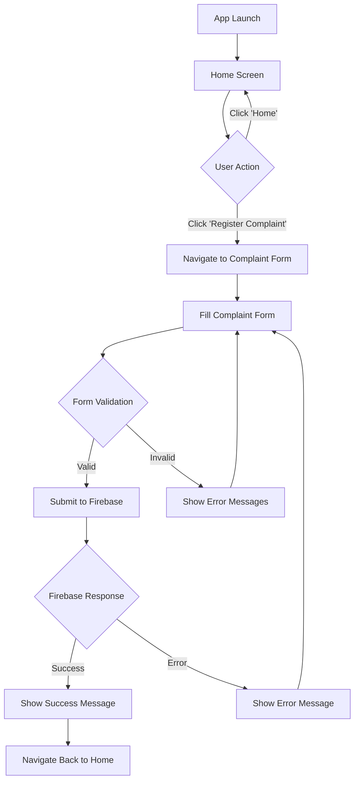

# Complaint Registration App

A Flutter mobile application for registering and managing complaints with Firebase backend integration.

## 📱 About the App

The Complaint Registration App is a simple yet effective mobile application that allows users to register complaints digitally. The app provides an intuitive interface for users to submit their personal details along with their complaints, which are then stored securely in a Firebase Firestore database.

## ✨ Features

- **Simple Navigation**: Clean home screen with easy-to-use navigation buttons
- **Complaint Form**: User-friendly form to capture personal details and complaint information
- **Real-time Database**: Firebase Firestore integration for secure data storage
- **Form Validation**: Built-in validation to ensure all required fields are filled
- **Success Feedback**: User feedback on successful complaint submission
- **Responsive Design**: Optimized for various screen sizes

## 🛠️ Technologies Used

- **Flutter**: Cross-platform mobile app framework
- **Dart**: Programming language
- **Firebase Core**: Firebase SDK for Flutter
- **Cloud Firestore**: NoSQL document database
- **Material Design**: UI/UX design system

## 📋 Prerequisites

Before running this app, make sure you have:

- Flutter SDK installed (version 3.0.0 or higher)
- Dart SDK
- Android Studio or VS Code with Flutter extensions
- Firebase account and project setup
- Android/iOS device or emulator

## 🚀 Installation & Setup

### 1. Clone the Repository
```bash
git clone https://github.com/yourusername/complaint-registration-app.git
cd complaint-registration-app
```

### 2. Install Dependencies
```bash
flutter pub get
```

### 3. Firebase Setup

#### Create Firebase Project
1. Go to [Firebase Console](https://console.firebase.google.com/)
2. Create a new project
3. Enable Firestore Database

#### Configure Firebase for Flutter
```bash
# Install FlutterFire CLI
dart pub global activate flutterfire_cli

# Configure Firebase
flutterfire configure
```

#### Setup Firestore Security Rules
1. Go to Firebase Console → Firestore Database → Rules
2. Replace the default rules with:
```javascript
rules_version = '2';
service cloud.firestore {
  match /databases/{database}/documents {
    match /complaints/{complaintId} {
      allow read, write: if true;
    }
  }
}
```
3. Click "Publish"

### 4. Run the App
```bash
flutter run
```

## 📱 App Screenshots

### Home Screen

*Main screen with navigation options*

### Complaint Registration Form
)
*Form for entering personal details and complaint*

### Success Message
)
*Confirmation message after successful submission*

### Firebase Database
)
*Complaints stored in Firestore database*


## 🔄 App Workflow



## 📁 Project Structure

```
lib/
├── main.dart                 # App entry point and Firebase initialization
├── screens/
│   ├── home_screen.dart      # Home screen with navigation buttons
│   └── complaint_screen.dart # Complaint registration form
└── firebase_options.dart     # Auto-generated Firebase configuration
```

## 🗃️ Database Schema

### Complaints Collection
```json
{
  "name": "String - User's full name",
  "email": "String - User's email address", 
  "complaint": "String - Detailed complaint description",
  "timestamp": "Timestamp - Auto-generated submission time"
}
```

## 🔧 Configuration Files

### pubspec.yaml Dependencies
```yaml
dependencies:
  flutter:
    sdk: flutter
  firebase_core: ^2.4.0
  cloud_firestore: ^4.3.0
  cupertino_icons: ^1.0.2
```

### Android Configuration
- Minimum SDK version: 21
- Target SDK version: 33
- Google Services plugin configured

## 🚦 Usage Instructions

1. **Launch the App**: Open the app on your device/emulator
2. **Navigate to Complaint Form**: Tap on "Register Complaint" button from home screen
3. **Fill the Form**: 
   - Enter your full name
   - Provide your email address
   - Write your detailed complaint
4. **Submit**: Tap "Send Complaint" button
5. **Confirmation**: You'll see a success message and return to home screen
6. **View Data**: Check Firebase Console to see submitted complaints

## 🔒 Security Considerations

**Important**: The current Firestore rules allow all read/write operations for testing purposes. For production deployment:

1. Implement Firebase Authentication
2. Update security rules to restrict access
3. Add user-specific data access controls
4. Enable security monitoring

Example production rules:
```javascript
rules_version = '2';
service cloud.firestore {
  match /databases/{database}/documents {
    match /complaints/{complaintId} {
      allow read, write: if request.auth != null;
      allow create: if request.auth != null && 
                   resource == null &&
                   request.resource.data.keys().hasAll(['name', 'email', 'complaint', 'timestamp']);
    }
  }
}
```

## 🐛 Troubleshooting

### Common Issues and Solutions

1. **Build Errors**
   ```bash
   flutter clean
   flutter pub get
   flutter run
   ```

2. **Firebase Permission Denied**
   - Check Firestore security rules
   - Ensure Firebase is properly initialized
   - Verify project configuration

3. **Import Errors**
   - Verify all dependencies in pubspec.yaml
   - Run `flutter pub get`
   - Restart your IDE

## 🤝 Contributing

1. Fork the repository
2. Create a feature branch (`git checkout -b feature/new-feature`)
3. Commit your changes (`git commit -am 'Add new feature'`)
4. Push to the branch (`git push origin feature/new-feature`)
5. Create a Pull Request

## 📄 License

This project is licensed under the MIT License - see the [LICENSE](LICENSE) file for details.

## 👨‍💻 Author

- **Your Name** - [Your GitHub Profile](https://github.com/yourusername)

## 📞 Support

If you encounter any issues or have questions:

1. Check the troubleshooting section
2. Open an issue on GitHub
3. Contact: your-email@example.com

## 🔮 Future Enhancements

- [ ] User authentication system
- [ ] Complaint status tracking
- [ ] Admin panel for complaint management
- [ ] Push notifications
- [ ] Image attachment support
- [ ] Complaint categories
- [ ] Search and filter functionality
- [ ] Offline support with local storage

---

**Made with ❤️ using Flutter and Firebase**
